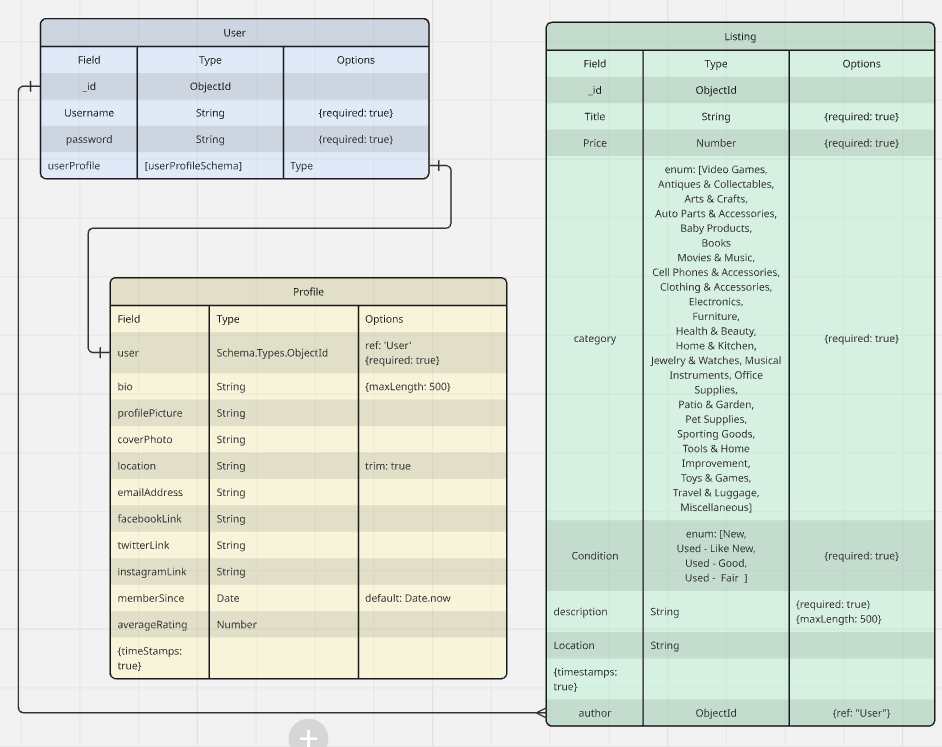
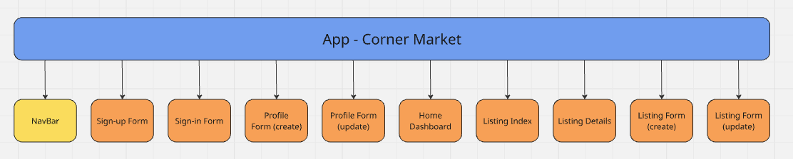

# Corner Market

#### Declutter your space and make extra cash with our easy-to-use online marketplace—post items you no longer need and connect with local buyers in your area.

## Description

Corner Market is a community-driven platform where users can sign up, create personalized profiles, and showcase their listings along with a short bio. Whether you're looking to sell something locally or find unique items nearby, Corner Market makes it easy. Post your listing and connect with other users through direct messaging to discuss details, negotiate prices, and arrange meetups.

## Table of Contents

- [Technologies Used](#technologiesused)
- [Features](#features)
- [Design](#design)
- [Project Next Steps](#nextsteps)
- [Deployed App](#deployment)
- [Contributors](#contributors)

## Technologies Used

### Frontend

- **React** – UI library for building dynamic user interfaces
- **React Router** – Client-side routing for React apps
- **React Dropzone** – File upload with drag-and-drop support
- **React Leaflet** – React components for Leaflet maps
- **Leaflet** – Interactive maps for the web
- **React Icons** – Popular icon packs as React components
- **Boxicons** – Simple and customizable icon set

### Backend

- **Node.js** – JavaScript runtime for server-side development
- **Express** – Web framework for Node.js
- **Mongoose** – ODM for MongoDB, simplifying data modeling
- **jsonwebtoken (JWT)** – Secure token-based authentication
- **Express Validator** – Middleware for validating/sanitizing user input
- **Multer** – Middleware for handling file uploads
- **UUID** – For generating unique IDs
- **Morgan** – HTTP request logger
- **Bcrypt** – Password hashing for secure login

### Utilities & Tools

- **Dotenv** – Load environment variables from a `.env` file
- **CORS** – Enable secure cross-origin requests
- **@mapbox/mapbox-sdk** – Mapbox SDK for geolocation and mapping services

### Languages

- **JavaScript** – Core programming language for both frontend and backend
- **CSS** – Styling language used for visual design and layout
- **HTML** – Markup language for structuring web content

---

### Stack

This project uses the **MERN stack**:

- **MongoDB**
- **Express**
- **React**
- **Node.js**

## Features

- **User Authentication**

  - Sign up as a new user
  - Log in with an existing account

- **Listings**

  - Create a new listing
  - View all listings
  - View details of a specific listing
  - Edit your own listings
  - Delete your own listings
  - Filter listings view based on a category

- **Listing Navigation**

  - Click on a listing to navigate to its details page
  - From the details page, authors can:
    - Edit their listing
    - Delete their listing

- **Location-Based Filtering**

  - Filter listings to only show those posted in the user’s local area

- **User Interaction**

  - View other users’ listings
  - View other users’ profiles

- **Messaging System**

  - Users can send messages to other users from a listing details page
  - Initiate conversations directly from a listing interaction
  - Each conversation has a dedicated thread that displays all messages
  - Users can view the full history of conversations
  - Direct messaging between users without leaving the platform

## Wireframe Images

## ERD Images & DB Structure

## Trello Planning

🔗 [Trello Planning Board](https://trello.com/b/5vQvZsrP/mern-stack-crud-app)

## Design Inspiration

Facebook Marketplace

## Project Next Steps

#### List of Future Features

- **Save Listings**

  - Users will be able to save/bookmark other users’ listings for later viewing

- **Author Rating System**

  - Users can rate listing authors, contributing to a visible average rating on their profile

- **UI Improvements**

  - Enhance user interface for better usability and visual polish across the app
  - Include mobile support

- **Messaging Enhancements**
  - Improve the in-app messaging experience with features like read receipts, typing indicators, and real-time updates

## Deployed Link

- [Corner Market](https://corner-market.netlify.app/)

# Repositories

## Back-End Repository

- [Corner Market Back-End](https://github.com/ashleylaisure/corner-market-back-end)

## Front-End Repository

- [Corner Market Front-End](https://github.com/ashleylaisure/corner-market-front-end)

## Contributors

### Ashley Laisure - SCRUM Lead Developer

- Major Contribution: UI Design

- [LinkedIn](www.linkedin.com/in/ashley-laisure-6a9475354)

- [Github](https://github.com/ashleylaisure)

### Casey Joiner - Lead Front-End Developer

- Major Contribution: Location Integration

- [LinkedIn](https://www.linkedin.com/)

- [Github](https://github.com/)

### James Palumbo - Lead Back-End Developer

- Major Contribution: Messaging System

- [LinkedIn](https://www.linkedin.com/)

- [Github](https://github.com/)

## Works Cited:

- [MDN Web Docs](https://developer.mozilla.org/)
- [Stack Overflow](https://stackoverflow.com/)
- [Regular Expressions](https://coderpad.io/blog/development/the-complete-guide-to-regular-expressions-regex/)
